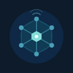
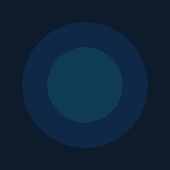
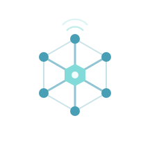

# Preview Baselines
## Android XML Resource Previews

Rendered from `:<module>:renderAndroidResources`. One row per (resource × qualifier × shape) capture. See [`design/RESOURCE_PREVIEWS.md`](https://github.com/yschimke/compose-ai-tools/blob/main/skills/compose-preview/design/RESOURCE_PREVIEWS.md) for the rendering catalogue.

### app

| Resource | Type | Qualifiers | Shape | Image |
|---|---|---|---|---|
| `drawable/ic_bluetooth_connected` | VECTOR | `xhdpi` | — |  |
| `drawable/ic_launcher_background` | VECTOR | `xhdpi` | — |  |
| `drawable/ic_launcher_foreground` | VECTOR | `xhdpi` | — |  |
| `mipmap/ic_launcher` | ADAPTIVE_ICON | `xhdpi` | LEGACY |  |
| `mipmap/ic_launcher` | ADAPTIVE_ICON | `xhdpi` | CIRCLE |  |
| `mipmap/ic_launcher` | ADAPTIVE_ICON | `xhdpi` | ROUNDED_SQUARE |  |
| `mipmap/ic_launcher` | ADAPTIVE_ICON | `xhdpi` | SQUARE |  |
| `mipmap/ic_launcher_round` | ADAPTIVE_ICON | `xhdpi` | LEGACY |  |
| `mipmap/ic_launcher_round` | ADAPTIVE_ICON | `xhdpi` | CIRCLE |  |
| `mipmap/ic_launcher_round` | ADAPTIVE_ICON | `xhdpi` | ROUNDED_SQUARE |  |
| `mipmap/ic_launcher_round` | ADAPTIVE_ICON | `xhdpi` | SQUARE |  |

### wear

| Resource | Type | Qualifiers | Shape | Image |
|---|---|---|---|---|
| `drawable/ic_launcher_background` | VECTOR | `xhdpi` | — |  |
| `drawable/ic_launcher_foreground` | VECTOR | `xhdpi` | — |  |
| `mipmap/ic_launcher` | ADAPTIVE_ICON | `xhdpi` | LEGACY |  |
| `mipmap/ic_launcher` | ADAPTIVE_ICON | `xhdpi` | CIRCLE |  |
| `mipmap/ic_launcher` | ADAPTIVE_ICON | `xhdpi` | ROUNDED_SQUARE |  |
| `mipmap/ic_launcher` | ADAPTIVE_ICON | `xhdpi` | SQUARE |  |

