# Preview Baselines
## Android XML Resource Previews

Rendered from `:<module>:composePreviewRenderAndroidResources`. One row per (resource × qualifier × shape) capture. See [`references/resource-previews.md`](https://github.com/yschimke/skills/blob/main/skills/compose-preview/references/resource-previews.md) for the rendering catalogue.

> [!WARNING]
> 16 resource capture(s) failed to render in the latest update (16 with no prior baseline to retain). See **Resource Render Failures** below.

### Resource Render Failures

The render task completed but no PNG was produced for these resource captures. Entries with a prior baseline keep their previous image; the rest are absent from the gallery until a successful render lands.

| Resource | Module | Type | Qualifiers | Shape | Baseline |
|---|---|---|---|---|---|
| `mipmap/ic_launcher` | app | ADAPTIVE_ICON | `xhdpi` | CIRCLE | none |
| `mipmap/ic_launcher` | app | ADAPTIVE_ICON | `xhdpi` | CIRCLE | none |
| `mipmap/ic_launcher` | app | ADAPTIVE_ICON | `xhdpi` | ROUNDED_SQUARE | none |
| `mipmap/ic_launcher` | app | ADAPTIVE_ICON | `xhdpi` | ROUNDED_SQUARE | none |
| `mipmap/ic_launcher` | app | ADAPTIVE_ICON | `xhdpi` | SQUARE | none |
| `mipmap/ic_launcher` | app | ADAPTIVE_ICON | `xhdpi` | SQUARE | none |
| `mipmap/ic_launcher` | app | ADAPTIVE_ICON | `xhdpi` | SQUIRCLE | none |
| `mipmap/ic_launcher` | app | ADAPTIVE_ICON | `xhdpi` | SQUIRCLE | none |
| `mipmap/ic_launcher_round` | app | ADAPTIVE_ICON | `xhdpi` | CIRCLE | none |
| `mipmap/ic_launcher_round` | app | ADAPTIVE_ICON | `xhdpi` | CIRCLE | none |
| `mipmap/ic_launcher_round` | app | ADAPTIVE_ICON | `xhdpi` | ROUNDED_SQUARE | none |
| `mipmap/ic_launcher_round` | app | ADAPTIVE_ICON | `xhdpi` | ROUNDED_SQUARE | none |
| `mipmap/ic_launcher_round` | app | ADAPTIVE_ICON | `xhdpi` | SQUARE | none |
| `mipmap/ic_launcher_round` | app | ADAPTIVE_ICON | `xhdpi` | SQUARE | none |
| `mipmap/ic_launcher_round` | app | ADAPTIVE_ICON | `xhdpi` | SQUIRCLE | none |
| `mipmap/ic_launcher_round` | app | ADAPTIVE_ICON | `xhdpi` | SQUIRCLE | none |

### app

| Resource | Type | Qualifiers | Shape | Image |
|---|---|---|---|---|
| `drawable/ic_bluetooth_connected` | VECTOR | `xhdpi` | — |  |
| `drawable/ic_launcher_background` | VECTOR | `xhdpi` | — | 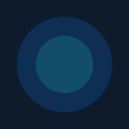 |
| `drawable/ic_launcher_foreground` | VECTOR | `xhdpi` | — | 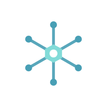 |
| `mipmap/ic_launcher` | ADAPTIVE_ICON | `xhdpi` | — |  |
| `mipmap/ic_launcher` | ADAPTIVE_ICON | `xhdpi` | CIRCLE |  |
| `mipmap/ic_launcher` | ADAPTIVE_ICON | `xhdpi` | ROUNDED_SQUARE |  |
| `mipmap/ic_launcher` | ADAPTIVE_ICON | `xhdpi` | SQUARE |  |
| `mipmap/ic_launcher` | ADAPTIVE_ICON | `xhdpi` | SQUIRCLE |  |
| `mipmap/ic_launcher_round` | ADAPTIVE_ICON | `xhdpi` | — |  |
| `mipmap/ic_launcher_round` | ADAPTIVE_ICON | `xhdpi` | CIRCLE |  |
| `mipmap/ic_launcher_round` | ADAPTIVE_ICON | `xhdpi` | ROUNDED_SQUARE |  |
| `mipmap/ic_launcher_round` | ADAPTIVE_ICON | `xhdpi` | SQUARE |  |
| `mipmap/ic_launcher_round` | ADAPTIVE_ICON | `xhdpi` | SQUIRCLE |  |

### wear

| Resource | Type | Qualifiers | Shape | Image |
|---|---|---|---|---|
| `drawable/ic_launcher_background` | VECTOR | `xhdpi` | — | 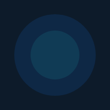 |
| `drawable/ic_launcher_foreground` | VECTOR | `xhdpi` | — | 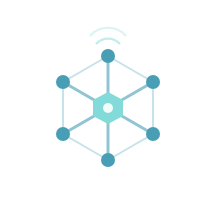 |
| `mipmap/ic_launcher` | ADAPTIVE_ICON | `xhdpi` | — | 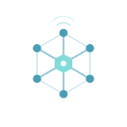 |
| `mipmap/ic_launcher` | ADAPTIVE_ICON | `xhdpi` | CIRCLE |  |
| `mipmap/ic_launcher` | ADAPTIVE_ICON | `xhdpi` | CIRCLE | 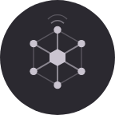 |
| `mipmap/ic_launcher` | ADAPTIVE_ICON | `xhdpi` | CIRCLE | 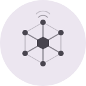 |
| `mipmap/ic_launcher` | ADAPTIVE_ICON | `xhdpi` | ROUNDED_SQUARE | 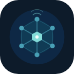 |
| `mipmap/ic_launcher` | ADAPTIVE_ICON | `xhdpi` | ROUNDED_SQUARE | 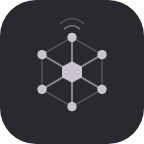 |
| `mipmap/ic_launcher` | ADAPTIVE_ICON | `xhdpi` | ROUNDED_SQUARE | 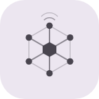 |
| `mipmap/ic_launcher` | ADAPTIVE_ICON | `xhdpi` | SQUARE | 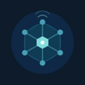 |
| `mipmap/ic_launcher` | ADAPTIVE_ICON | `xhdpi` | SQUARE | 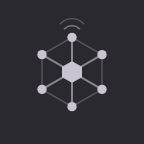 |
| `mipmap/ic_launcher` | ADAPTIVE_ICON | `xhdpi` | SQUARE | 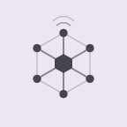 |
| `mipmap/ic_launcher` | ADAPTIVE_ICON | `xhdpi` | SQUIRCLE | 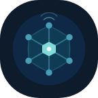 |
| `mipmap/ic_launcher` | ADAPTIVE_ICON | `xhdpi` | SQUIRCLE | 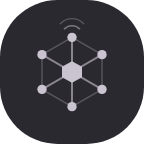 |
| `mipmap/ic_launcher` | ADAPTIVE_ICON | `xhdpi` | SQUIRCLE | 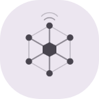 |

