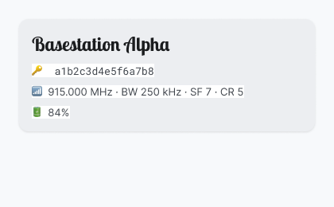

# Design brief — DeviceSummaryCard title → Lobster Two

> **Design-led exploration.** This PR carries a design change made in Figma and asks
> `@claude` to bring the code to match. It is a *demo of the inbound design→code flow*
> and is not expected to land.

## The change

The designer changed the **device-name title** in `DeviceSummaryCard` to the
**Lobster Two** display font (a script/display face), replacing the current
branded display face. Everything else on the card is unchanged.

**Reference (rendered from the Figma node):**

The editable vector spec is committed alongside as [`reference.figma.svg`](./reference.figma.svg).

## Target

- **Component:** `DeviceSummaryCard` — `meshcore-components/src/commonMain/kotlin/ee/schimke/meshcore/components/ui/DeviceCards.kt`
- The device-name `Text` currently uses `MaterialTheme.typography.titleLarge`.
- **Font mechanism:** `meshcore-components/.../ui/theme/MeshcoreFonts.kt` declares the
  branded families via `expect val` (Orbitron / Space Grotesk / JetBrains Mono),
  with per-platform `actual`s — Android pulls from the **Google Fonts downloadable
  provider** (`MeshcoreFonts.android.kt`), desktop loads bundled `.ttf`
  (`MeshcoreFonts.desktop.kt`).

## Ask

Make the `DeviceSummaryCard` device-name title render in **Lobster Two** to match
`reference.png`. Mirror how the existing families are provided — add a
`LobsterTwo` `FontFamily` (Google Fonts downloadable provider on Android, matching
`actual` on desktop) and apply it to the title (either a dedicated display style or
directly on the title `Text`). Add / update a `@Preview` so the change is visible,
and render it to confirm the title is now Lobster Two.
